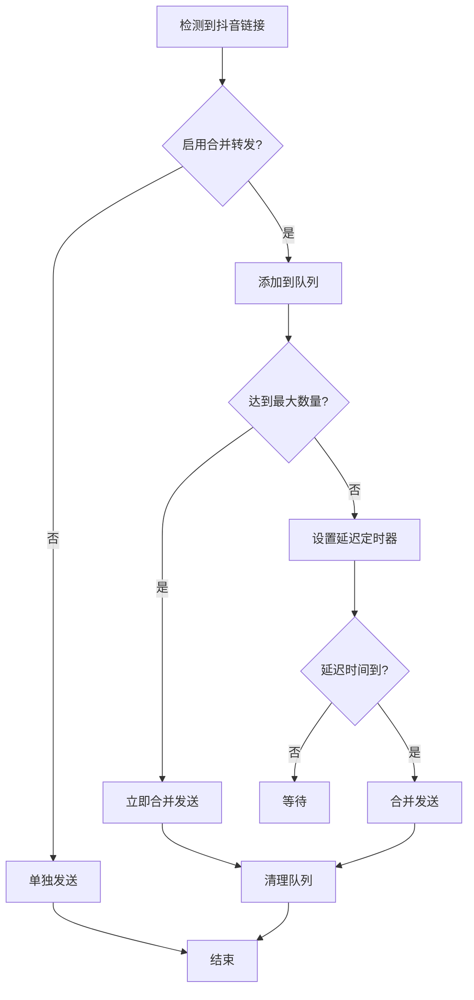

# 📱 合并转发功能说明

## 🎯 功能概述

合并转发功能是 `koishi-plugin-douyin-parsing-fork` 插件的一个高级特性，它能够智能地将短时间内发送的多个抖音视频链接合并成一条消息，有效减少消息刷屏，提升聊天体验。

## ✨ 工作原理

### 1. 智能队列管理
- 当检测到抖音链接时，插件会将其添加到合并转发队列
- 每个会话（群聊/私聊）都有独立的队列
- 支持配置延迟时间和最大消息数量

### 2. 触发条件
合并转发会在以下任一条件满足时触发：
- **数量触发**: 队列中的消息数量达到配置的最大值
- **时间触发**: 距离第一条消息超过配置的延迟时间

### 3. 消息格式
合并后的消息包含：
- 视频合集标题和数量
- 每个视频的详细信息（标题、作者、封面、链接）
- 结构化的展示格式

## ⚙️ 配置选项

| 配置项 | 类型 | 默认值 | 说明 |
|--------|------|--------|------|
| `enableMergeForward` | `boolean` | `false` | 是否启用合并转发功能 |
| `mergeForwardDelay` | `number` | `1000` | 合并转发延迟时间（毫秒） |
| `mergeForwardMaxCount` | `number` | `5` | 合并转发最大消息数量 |

## 🔧 配置示例

### 基础配置
```typescript
export default {
  plugins: {
    'douyin-parsing-fork': {
      // 启用合并转发
      enableMergeForward: true,
      // 延迟1秒后合并
      mergeForwardDelay: 1000,
      // 最多合并5个视频
      mergeForwardMaxCount: 5
    }
  }
}
```

### 快速合并配置
```typescript
export default {
  plugins: {
    'douyin-parsing-fork': {
      enableMergeForward: true,
      // 快速合并，延迟500毫秒
      mergeForwardDelay: 500,
      // 合并更多视频
      mergeForwardMaxCount: 10
    }
  }
}
```

### 慢速合并配置
```typescript
export default {
  plugins: {
    'douyin-parsing-fork': {
      enableMergeForward: true,
      // 慢速合并，延迟3秒
      mergeForwardDelay: 3000,
      // 合并较少视频
      mergeForwardMaxCount: 3
    }
  }
}
```

## 📱 使用场景

### 1. 群聊环境
- **减少刷屏**: 当多个用户同时分享抖音视频时，自动合并
- **提升体验**: 避免消息过多影响其他用户阅读
- **保持整洁**: 群聊界面更加清晰有序

### 2. 私聊环境
- **批量分享**: 用户分享多个视频时自动整理
- **时间管理**: 根据延迟时间智能合并
- **个性化**: 可调整合并策略

### 3. 频道环境
- **内容聚合**: 将相关内容聚合展示
- **阅读友好**: 提供更好的阅读体验
- **管理便利**: 便于管理员管理内容

## 🔄 工作流程



## 💡 最佳实践

### 1. 延迟时间设置
- **快速响应**: 500-1000ms，适合活跃群聊
- **平衡模式**: 1000-2000ms，适合一般使用
- **慢速模式**: 2000-5000ms，适合内容较多的场景

### 2. 最大数量设置
- **少量合并**: 3-5个，适合一般使用
- **中等合并**: 5-10个，适合活跃群聊
- **大量合并**: 10-20个，适合内容聚合场景

### 3. 场景适配
```typescript
// 活跃群聊配置
{
  enableMergeForward: true,
  mergeForwardDelay: 800,
  mergeForwardMaxCount: 8
}

// 内容聚合配置
{
  enableMergeForward: true,
  mergeForwardDelay: 2000,
  mergeForwardMaxCount: 15
}

// 私聊配置
{
  enableMergeForward: true,
  mergeForwardDelay: 1500,
  mergeForwardMaxCount: 5
}
```

## 🚨 注意事项

### 1. 性能考虑
- 合并转发会增加内存使用
- 长时间不触发的队列会占用资源
- 建议根据实际使用情况调整配置

### 2. 兼容性
- 功能基于 Koishi 4.x 框架
- 需要支持 h() 函数的平台
- 某些平台可能不支持复杂消息格式

### 3. 降级处理
- 如果合并转发失败，会自动降级为单独发送
- 确保功能的稳定性和可靠性
- 提供详细的调试日志

## 🔍 调试信息

启用调试模式后，可以查看详细的合并转发日志：

```typescript
{
  debug: true,
  enableMergeForward: true
}
```

日志内容包括：
- 队列状态变化
- 触发条件满足情况
- 合并发送结果
- 错误处理和降级信息

## 🎯 未来改进

- [ ] 支持更多消息格式
- [ ] 智能延迟时间调整
- [ ] 跨会话合并支持
- [ ] 自定义合并模板
- [ ] 统计分析功能

---

**注意**: 合并转发功能是可选的，默认关闭。用户可以根据实际需求启用和配置。
